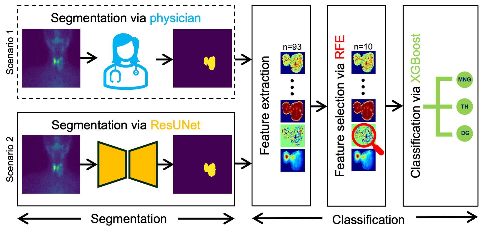
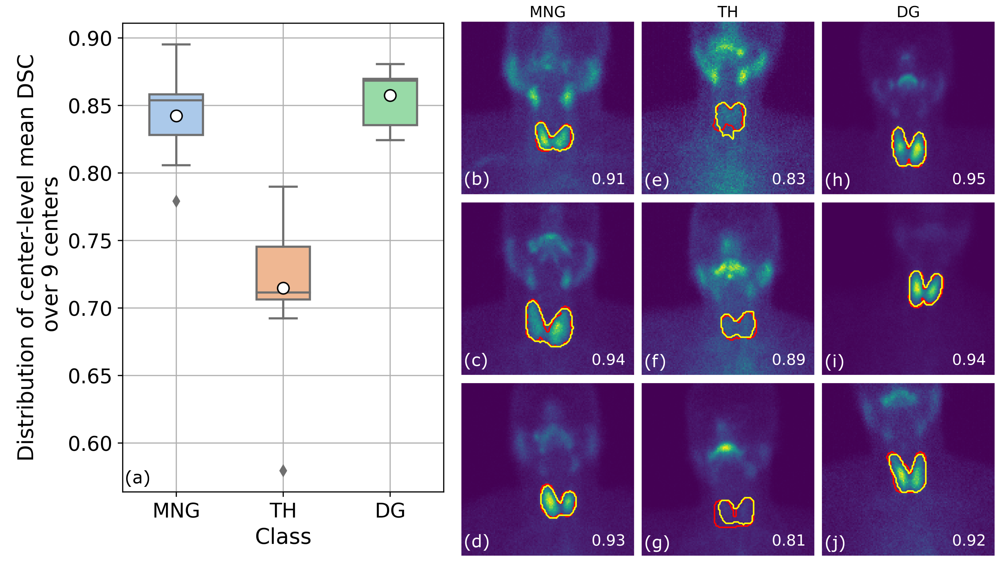

# Thyroidiomics: An Automated Pipeline for Segmentation and Classification of Thyroid Pathologies from Scintigraphy Images


## Introduction
This codebase is related to our submission to EUVIP 2024:<br>
> Anonymous authors, _Thyroidiomics: An Automated Pipeline for Segmentation and Classification of Thyroid Pathologies from Scintigraphy Images_.

<p align="center">

</p>
<p align="center", style="font-size:8px">
    Figure 1: <i>Thyroidiomics</i>: the proposed two-step pipeline to classify thyroid pathologies into three classes, namely, MNG, TH and DG. Scenario 1 represents the pipeline dependent on physician's delineated ROIs as input to the classifier, while scenario 2 represents the fully automated pipeline operating on segmentation predicted by ResUNet.
</p>

<p align="justify">
The objective of this study was to develop an automated pipeline that enhances thyroid disease classification using thyroid scintigraphy images, aiming to decrease assessment time and increase diagnostic accuracy. Anterior thyroid scintigraphy images from 2,643 patients were collected and categorized into diffuse goiter (DG), multinodal goiter (MNG), and thyroiditis (TH) based on clinical reports, and then segmented by an expert. A Residual UNet (ResUNet) model was trained to perform auto-segmentation. Radiomics features were extracted from both physician's (scenario 1) and ResUNet segmentations (scenario 2), followed by omitting highly correlated features using Spearman's correlation, and feature selection using Recursive Feature Elimination (RFE) with eXtreme Gradient Boosting (XGBoost) as the core. All models were trained under leave-one-center-out cross-validation (LOCOCV) scheme, where nine instances of algorithms was iteratively trained and validated on data from eight centers and tested on the ninth for both scenarios separately. Segmentation performance was assessed using the Dice similarity coefficient (DSC), while classification performance was assessed using metrics such as precision, recall, F1-score, accuracy, area under the Receiver Operating Characteristic (ROC AUC), and area under the precision-recall curve (PRC AUC). ResUNet obtained DSC values of 0.84±0.03, 0.71±0.06, and 0.86±0.02 for MNG, TH, and DG, respectively. Classification in scenario 1 achieved an accuracy of 0.76±0.04 and a ROC AUC of 0.92±0.02 while in scenario 2, classification yielded an accuracy of 0.74±0.05 and a ROC AUC of 0.90±0.02. The automated pipeline demonstrated comparable performance to physician segmentations on several classification metrics across different classes, effectively reducing assessment time while maintaining high diagnostic accuracy.
</p>

### Segmentation 
<p align="center">

</p>
<p align="center", style="font-size:8px">
    Figure 2: (a) Distribution of center-level mean DSC over 9 centers for the classes, MNG, TH and DG. (b)-(d), (e)-(g), and (h)-(j) show some representative images from each class with the ground truth (red) and ResUNet predicted (yellow) segmentation of thyroid. The DSC between ground truth and predicted masks is shown in the bottom-right of each figure.
</p>

### Classification
<p align="center">

</p>
<p align="center", style="font-size:8px">
    Figure 3: Various class-wise and averaged metrics for classification were used to evaluate model performance in two scenarios: features extracted from the physician's delineated ROIs and those from ResUNet predicted ROIs. The boxplots show the distribution of metrics over the nine centers as test sets for the three thyroid pathology classes, MNG, TH and DG. The black horizontal lines denote the median and white circle denote the mean of distribution.
</p>


## How to get started?
Follow the intructions given below to set up the necessary conda environment, install packages, preprocess dataset in the correct format so it can be accepted as inputs by the code, train model and perform anomaly detection on test set using the trained models. 

- **Clone the repository, create conda environment and install necessary packages.** The first step is to clone this GitHub codebase in your local machine, create a conda environment, and install all the necessary packages. This code base was developed primarily using python=3.9.19, PyTorch=1.11.0, monai=1.3.1 and CUDA 11.4 on a Microsoft Azure virtual machine with Ubuntu 20.04, so the codebase has been tested only with these configurations. The virtual machine had one GPU with 16 GiB of RAM and 6 vCPUs with 112 GB of RAM. We hope this codebase will run in other suitable combinations of different versions of python, PyTorch, monai, and CUDA, but we cannot guarantee that. Proceed with caution and feel free to modify wherever necessary!

    ```
    git clone 'https://github.com/igcondapet/thyroidiomics.git'
    cd thyroidiomics
    conda env create --file environment.yml
    ```
    The last step above creates a conda environment named `thyroidiomics_env`. Make sure you have conda installed. Next, activate the conda environment
    ```
    conda activate thyroidiomics_env
    ```
- **Define dataset location and create datainfo.csv file.** Go to [config.py](config.py) and set path to data folders for your (possibly multi-institutional) scintigraphy datasets. 
    ```
    THYROIDIOMICS_FOLDER = '' # path to the directory containing `data` and `results` (this will be created by the pipeline) folders.
    DATA_FOLDER = os.path.join(THYROIDIOMICS_FOLDER, 'data', 'nifti') # place your data in this location
    ```
    The directory structure within `THYROIDIOMICS_FOLDER` should be as shown below. The folders `images` and `labels` under `THYROIDIOMICS_FOLDER/data/nifti` must contain all the 2D scintigraphy images and ground truth segmentation labels from all the multi-institutional datasets in `.nii.gz` format with each image-label pair given the same filenames. Other folders containing the results of segmentation (`THYROIDIOMICS_FOLDER/segmentation_results`) and classification (`THYROIDIOMICS_FOLDER/classification_results`) steps will be created in the subsequent steps below.

        └───THYROIDIOMICS_FOLDER/
            ├──data/nifti/
            │  ├── images
            │  │   ├── Patient0001.nii.gz
            │  │   ├── Patient0002.nii.gz
            │  │   ├── ...
            │  ├── labels
            │  │   ├── Patient0001.nii.gz
            │  │   ├── Patient0002.nii.gz 
            │  │   ├── ...
            ├──classification_results
            └──segmentation_results
        

    Next, create a file named `datainfo.csv` containing information about `PatientID` (corresponding to image filenames), `CenterID` and `Class` as shown below. For this work, we had 3 classes corresponding to 3 thyroid pathologies: MNG (label=0), TH (label=1) and DG (label=2). 
    ```
    PatientID,CenterID,Class
    Patient0001,A,0
    Patient0002,B,1
    Patient0003,D,2
    Patient0004,C,2
    Patient0005,I,1
    ...
    ...
    ...
    ```
    Place the `datainfo.csv` file in this location: `thyroidiomics/data_analysis/datainfo.csv`
    
- **Run segmentation training.** The file [thyroidiomics/train.py](thyroidiomics/trainddp.py) runs training on the 2D dataset via PyTorch's `DistributedDataParallel`. To run training, do the following (an example bash script is given in [thyroidiomics/segmentation/train.sh](thyroidiomics/segmentation/train.sh)):
    ```
    cd thyroidiomics/segmentation
    CUDA_VISIBLE_DEVICES=0 torchrun --standalone --nproc_per_node=1 train.py --network-name='unet1' --leave-one-center-out='A' --epochs=300 --input-patch-size=64 --inference-patch-size=128 --train-bs=32 --num_workers=4 --lr=2e-4 --wd=1e-5 --val-interval=2 --sw-bs=4 --cache-rate=1

    ```
    A unique experimentID will be created using the `network_name` and `leave_one_center_out`. For example, if you used `unet1` and choose leave-one-center-out (loco) center as `A` for testing, this experiment will be referenced as `unet1_locoA` under the results folders. Set `--nproc_per_node` as the number of GPU nodes available for parallel training. The data is cached using MONAI's `CacheDataset`, so if you are running out of memory, consider lowering the value of `cache_rate`. During training, the training loss and validation DSC are saved under `THYROIDIOMICS_FOLDER/segmentation_results/logs/trainlog_gpu{rank}.csv` and `THYROIDIOMICS_FOLDER/segmentation_results/logs/validlog_gpu{rank}.csv` where `{rank}` is the GPU rank and updated every epoch. The checkpoints are saved every `val_interval` epochs under `THYROIDIOMICS_FOLDER/segmentation_results/models/model_ep{epoch_number}.pth`. There are many networks defined under the `get_model()` method in the file [thyroidiomics/segmentation/initialize_train.py](thyroidiomics/segmentation/initialize_train.py), but in this work, we used the network `unet1` as that had the best performance. 

- **Run segmentation evaluation on test set.** After the training is finished (for a given experimentID), [thyroidiomics/segmentation/predict.py](thyroidiomics/segmentation/predict.py) can be used to run evaluation on the test set (which consists of all the data left out in LOCOCV scheme, here `CenterID=A` from the above example) and save the predictions, testmetrics and visualization of predicted results. To run test evaluation, do the following (an example bash script is given in [thyroidiomics/segmentation/predict.sh](thyroidiomics/segmentation/predict.sh)):
    ```
    cd thyroidiomics/segmentation
    python predict.py --network-name='unet1' --leave-one-center-out='A' --inference-patch-size=128 --num_workers=2  --sw-bs=2 --val-interval=2
    ```
    [thyroidiomics/segmentation/predict.py](thyroidiomics/segmentation/predict.py) uses the model with the highest DSC on the validation set for test evaluation. CAUTION: set `--val-interval` to the same value that was used during training.

# References

<a id="1">[1]</a> 


<a id="2">[2]</a> 


<a id="3">[3]</a> 

<a id="4">[4]</a> 
